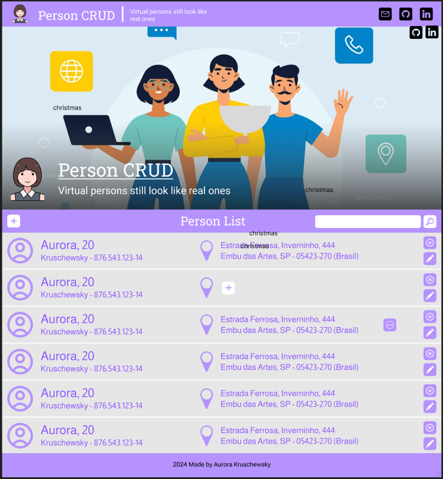

# Person CRUD - FrontEnd

As the name implies, this is the FrontEnd of the CRUD Person!

As this README is a little bigger than usual, here's a easy way to find what you're looking for:

## Table of Contents
- [Project Design](#project-design)
- [Running the Project](#running-the-project)
- [Developing the Project](#developing-the-project)
- [License](#license)


## Project Design

The design for the site was made in Figma and can be viewed here:


The project is composed from one main page that would handle all the get requisitions.



And we have the differents modals for the following actions:

- Create Person:


- Select Avatar:


- Update Person:


- Add Address:


- Update Address:


- Show Person Info:


## Running the Project

As this project need the backEnd to work, we first need to run it.

- Step 1: Clone the backEnd repository if you don't have it.

    ```git clone https://github.com/AurorinhaBoreal/PersonCRUD-BackEnd.git```

- Step 2: Create the PostgreSQL container for the backEnd.

    ```docker compose up -d```

- Step 3: Run the backEnd project using gradle.

    ```gradle bootRun```

- Step 4: After these steps you can run the frontEnd Project.

    ```npm run dev```

## Developing the Project

The first part of a project is the organization of it's own creation. This topic will be for that

### US's - MVP

- 🚧 [US001] Create Structure for Home Page
  - 🚧 [US001-1] Create Header
  - 🚧 [US001-2] Create Main Image
  - 🚧 [US001-3] Create List Structure
  - 🚧 [US001-4] Create Footer
- 🚧 [US002] Create Header Hide Logic
- 🚧 [US003] Create Post Modals
  - 🚧 [US003-1] Create Person Create Modal
  - 🚧 [US003-2] Create Address Create Modal
  - 🚧 [US003-3] Create Choose Avatar Modal
- 🚧 [US004] Implement Post Method
  - 🚧 [US004-1] Implement Person Post 
  - 🚧 [US004-2] Implement Address Post
- 🚧 [US005] Create Update Modals
  - 🚧 [US005-1] Create Person Update Modal
  - 🚧 [US005-2] Create Address Update Modal
- 🚧 [US006] Implement Update Method
  - 🚧 [US006-1] Implement Person Update
  - 🚧 [US006-1] Implement Address Update
- 🚧 [US007] Create Remaining Modals
  - 🚧 [US007-1] Create Person Info Modal
- 🚧 [US008] Create Delete Buttons 
  - 🚧 [US008-1] Implement Delete Buttons on Home
  - 🚧 [US008-1] Implement Delete Buttons on Person Info

### US's - EXTRA

- 🚧 [US00X-1] Implement ChakraUI Themes
- 🚧 [US00X-2] Implement ChakraUI Components Stylization

## License
This project is licensed under the MIT License. See the [LICENSE](LICENSE) file for details.